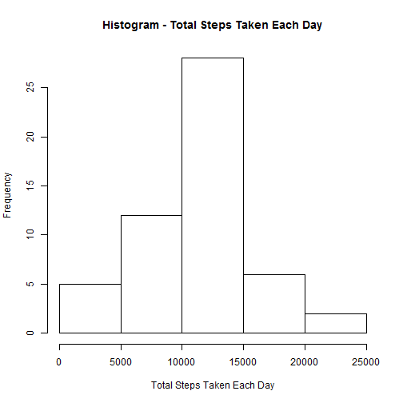
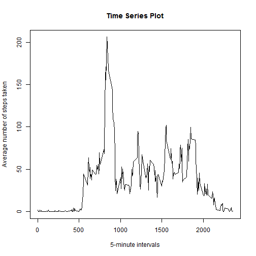
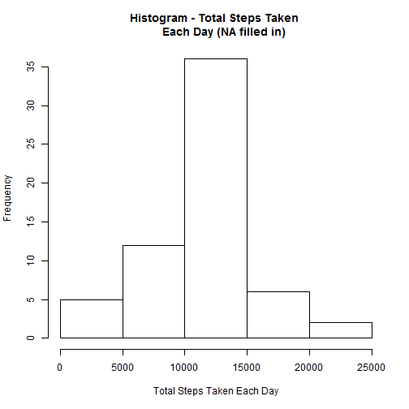
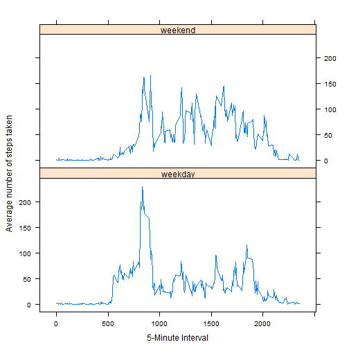

Reproducible Research - bluesungod's Peer Assessment #1
========================================================

This report is meant to answer questions posed by the first Peer Assessment assignment in the Reproducible Research course (through Johns Hopkins and Coursera).

# Loading and preprocessing the data

## Loading the data

First, let's load the data that we will use and see an example of what it looks like. Make sure the working directory is the same one that this R markdown file is in (because "activity.csv" is in that directory as well).


```r
dat <- read.csv("activity.csv")
```

## Preprocessing the data

Let's do some preprocessing work to create data frames that we'll be using to answer questions later.


```r
# The date column is not currently in the right date format - let's fix that.
dat$date <- as.Date(dat$date, format = "%Y-%m-%d")

# We will need a data frame with the total number of steps per day for later.
datestepstotal <- aggregate(dat$steps, by = list(dat$date), sum)
names(datestepstotal) <- c("date", "TotalSteps")

# We will also need a data frame with the total number of steps per interval.
intervalstepstotal <- aggregate(dat$steps, by = list(dat$interval), sum, 
      na.rm = TRUE)
names(intervalstepstotal) <- c("interval", "TotalSteps")

# Finally, we will need a data frame with the mean number of steps per interval.
intervalstepsmean <- aggregate(dat$steps, by = list(dat$interval), mean, 
      na.rm = TRUE)
names(intervalstepsmean) <- c("interval", "MeanSteps")
```

Okay, we should now be all set to answer the questions that follow.

# What is mean total number of steps taken per day?

## Histogram of the total number of steps taken per day

We're going to use the first data frame that we processed earlier to help us here.


```r
hist(datestepstotal$TotalSteps, main = "Histogram - Total Steps Taken Each Day", 
     xlab = "Total Steps Taken Each Day")
```

 

## Calculating the mean and median number of steps taken per day

We can use the mean() and median() functions to help us here.

The mean number of steps per day is found by doing:


```r
mean(datestepstotal$TotalSteps, na.rm = TRUE)
```

```
## [1] 10766
```

The median number of steps per day is found by doing:


```r
median(datestepstotal$TotalSteps, na.rm = TRUE)
```

```
## [1] 10765
```
Thus, the **mean** is **10766** and the **median** is **10765**.

# What is the average daily activity pattern?

## Time series plot portion

We can use the third data frame that we processed at the beginning to help us here.


```r
plot(intervalstepsmean$interval, intervalstepsmean$MeanSteps, type = "n", 
     main = "Time Series Plot", xlab = "5-minute intervals", 
     ylab = "Average number of steps taken")
lines(intervalstepsmean$interval, intervalstepsmean$MeanSteps, type = "l")
```

 

## Finding the interval with the (average) maximum number of steps

We can use the which.max function to help us find the relevant 5-minute interval.


```r
intervalstepsmean[which.max(intervalstepsmean$MeanSteps), 1]
```

```
## [1] 835
```

Therefore, the 5-minute interval with the maximum number of steps is **835** and the average maximum number of steps there is **206.17**.

# Imputing missing values

## Total number of missing values

To find the total number of missing values, we can use:


```r
sum(is.na(dat$steps))
```

```
## [1] 2304
```

There are **2304** missing values in the whole dataset.

## Filling in missing values

To complete the dataset, let's replace each missing value with the mean number of steps for that 5-minute interval. To do this, we should first bring together a couple of data frames.


```r
dat.missing <- merge(dat, intervalstepsmean, by = "interval", sort = FALSE)
# Sort on date and interval to make things easier.
dat.missing <- dat.missing[with(dat.missing, order(date, interval)), ]
```

Now we will set each NA value equal to the 'MeanSteps' value for that same column.


```r
dat.missing$steps[is.na(dat.missing$steps)] <- 
    dat.missing$MeanSteps[is.na(dat.missing$steps)]
# Check to make sure it worked.
head(dat.missing)
```

```
##     interval   steps       date MeanSteps
## 1          0 1.71698 2012-10-01   1.71698
## 63         5 0.33962 2012-10-01   0.33962
## 128       10 0.13208 2012-10-01   0.13208
## 205       15 0.15094 2012-10-01   0.15094
## 264       20 0.07547 2012-10-01   0.07547
## 327       25 2.09434 2012-10-01   2.09434
```

## Creating a new dataset with the missing data filled in

Doing this is as easy as reordering the columns in the new dataset we just created.


```r
filleddat <- dat.missing[, c(2, 3, 1)]
```

## New histogram of total number of steps

We use the same process as we had used before to create a new histogram once the NA values have been replaced. First we aggregate and sum up the steps data by each date. Then we plot!


```r
# Aggregate and sum up.
filled.datestepstotal <- aggregate(filleddat$steps, by = list(filleddat$date), 
    sum)
names(filled.datestepstotal) <- c("date", "TotalSteps")

# Plot histogram.
hist(filled.datestepstotal$TotalSteps, main = "Histogram - Total Steps Taken 
     Each Day (NA filled in)", xlab = "Total Steps Taken Each Day")
```

 

## New mean and median total number of steps per day

Again, we use the same functions. For the mean:


```r
mean(filled.datestepstotal$TotalSteps, na.rm = TRUE)
```

```
## [1] 10766
```

For the median:

```r
median(filled.datestepstotal$TotalSteps, na.rm = TRUE)
```

```
## [1] 10766
```

The mean and median are now equivalent. The mean is about the same as it was earlier, but the median has gone up slightly from before after the missing values were filled in.

By imputing missing data, estimates of the total daily number of steps seem to converge, though the overall shape of the histograms are very similar before and after.

# Are there differences in activity patterns between weekdays and weekends?

## Creating a new factor variable to identify weekdays and weekends

First, let's add a new column to the dataset that provides the day of the week for the date.


```r
filleddat$dayofweek <- factor(format(filleddat$date, "%A"))
```

Now we distill the levels of the factor variable down to two from seven.


```r
# Check what the levels currently are for the new column.
levels(filleddat$dayofweek)
```

```
## [1] "Friday"    "Monday"    "Saturday"  "Sunday"    "Thursday"  "Tuesday"  
## [7] "Wednesday"
```


```r
# Distill the levels.
levels(filleddat$dayofweek) <- list(weekday = c("Monday", "Tuesday",
    "Wednesday", "Thursday", "Friday"), weekend = c("Saturday", "Sunday"))
```

Just to check:

```r
levels(filleddat$dayofweek)
```

```
## [1] "weekday" "weekend"
```

Cool, we did it.

## Panel plot containing time series plot

We have to create a new data frame with mean steps (one with the NA values filled in). Then we plot away.


```r
filled.intervalstepsmean <- aggregate(filleddat$steps, by = 
    list(filleddat$dayofweek, filleddat$interval), mean, na.rm = TRUE)
names(filled.intervalstepsmean) <- c("DayOfWeek", "interval", "MeanSteps")

# Make sure the lattice library is called.
library(lattice)
xyplot(filled.intervalstepsmean$MeanSteps ~ filled.intervalstepsmean$interval | 
    filled.intervalstepsmean$DayOfWeek, layout = c(1, 2), type = "l", 
    xlab = "5-Minute Interval", ylab = "Average number of steps taken")
```

 

**And we're all set! Thanks for watching!**
